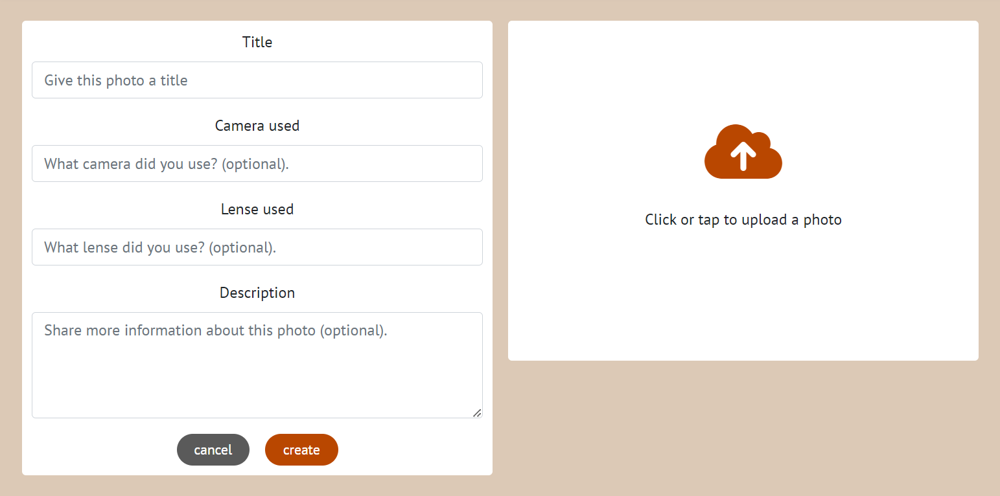
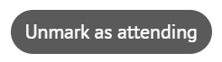

# Captured
Captured is a content sharing platform for photographers. Users can showcase their own photographs along with details concerning them and interact with other users via likes, comments and follows. The site is also used as an advertising platform for the site admin to share photographic tour opportunities that users can choose to attend.

This repository is for the frontend section of the project and is associated with the [captured DRF-API](https://github.com/Tony118g/captured-drf-api).

## Contents

* [Project Goals](#project-goals)
* [User Experience](#user-experience)
    * [Target Audience](#target-audience)
    * [Epics](#epics)
    * [User Stories](#user-stories)
    * [Site Structure](#site-structure)
    * [Design Choices](#design-choices)
        * [Typography](#typography)
        * [Colour Palette](#colour-palette)
* [Project Management](#project-management)
* [Features](#features)
    * [Existing Features](#existing-features)
        * [Navigation](#navigation)
        * [Login, Signup and Logout](#login-signup-and-logout)
        * [The About Page](#the-about-page)
        * [The Popular Profiles Display](#the-popular-profiles-display)
        * [Likes and Comments](#likes-and-comments)
        * [Tours](#tours)
        * [Tour Attendance Options](#tour-attendance-options)
        * [User Profiles](#user-profiles)
        * [Edit and Delete dropdown menus](#edit-and-delete-dropdown-menus)
        * [Deletion Confirmation Prompts](#deletion-confirmation-prompts)
        * [Search Bars](#search-bars)
        * [Inifinite Scrolling](#inifinite-scrolling)
        * [Access Token Refreshing](#access-token-refreshing)
    * [Future Features](#future-features)
* [Technologies Used](#technologies-used)
* [Deployment and Development](#deployment-and-development)
    * [Deploying the Site](#deployment)
    * [Forking the Repository](#forking-the-repository)
    * [Cloning the Repository](#cloning-the-repository)
    * [Connecting the API](#connecting-the-api)

## Project Goals
Captured is designed and intended to be a social, educational and promotive platform for photography enthusiasts to share and interact with content related to photography. The primary goals to achieve this are as follows:

* General aspects:
    * Deliver a simple and intuitive user experience.
    * Provide minimal yet impactful features chosen specifically to deliver a useful application within the given development timeframe, while laying out the possibility for additional features in the future.

* Social aspect:
    * Provide the ability for users to share content related to photography.
    * Provide the ability for users to interact with each other via likes, comments and followers.

* Educational aspect:
    * Add the ability for users to share informational details about their photographs.
    * Provide a way for users to view the informational content pertaining to photographs.
    * Provide functionality for users to be able to add detailed views or ask questions pertaining to photographs via comments.

* Promotive aspect:
    * Deliver a way for the site admin to advertise photographic tours.
    * Provide the ability for users to view available tours on the site.
    * Provide functionality for users to be able to specify whether they intend to attend an advertised tour.

## User Experience

### Target Audience
The site is primarily targeted towards photography enthusiasts regardless of age, gender, ethnicity or skill level. Intended users are anyone with an interest in photography. The sharing platform provides a way for photographers to interact and learn from one another as well as simply view content that interests them. The tours section of the site is aimed mainly towards but not limited to amateur and aspiring photographers as it advertises photography tours that they may join in order to learn and gain experience.

### Epics
During the planning process, I created 9 epics which were then broken down further into a total of 39 user stories. These can be found in the [project kanban board](https://github.com/users/Tony118g/projects/10) or they can be viewed individually via the links below.

1. [Authentication](https://github.com/Tony118g/captured/issues/1)
2. [Navigation](https://github.com/Tony118g/captured/issues/2)
3. [Profile Management](https://github.com/Tony118g/captured/issues/3)
4. [Profile Interaction](https://github.com/Tony118g/captured/issues/4)
5. [Photo Post Management](https://github.com/Tony118g/captured/issues/5)
6. [Photo Post Interaction](https://github.com/Tony118g/captured/issues/6)
7. [Tour Post Management](https://github.com/Tony118g/captured/issues/7)
8. [Tour Post Interaction](https://github.com/Tony118g/captured/issues/8)
9. [General Site Interaction](https://github.com/Tony118g/captured/issues/9)

### User Stories
The project epics were further broken down into user stories. These stories were created using MoSCoW (must have, should have, could have, and won't have) prioritization with each story being assigned a label in accordance with its level of priority.

Story points were also assigned to each story using labels. These points were assigned using my best estimation of the time and difficulty of completing each user story based on my experience and ability.

Each user story has it's own acceptance criteria and tasks associated with it. This helped ensure all requirements for each story were known as they were developed and helped keep track of development progress.

All user stories for this project can be found in the [project kanban board](https://github.com/users/Tony118g/projects/10). Some user stories were developed based on an ideal scenario while knowing that it was unlikely that they would be implemented for this first release of the site. These however were not crucial to the project and their absence does not impact the site in any significant way. I may revisit them in a future development along with any other possible features required as the site grows. More details on potential future features can be found [here](#future-features).

Below is a summary of the user stories for this version of the project's release listed by epic.

* Epic - authentication
    * As a user I can register an account so that I can access all features of the site.
    * As a user I can login and logout of my account so that I can use the site and keep my account secure.
    * As a user I can easily find out my logged in/out status so that I can decide what to do next.
    * As a site owner I want to refresh access tokens so that users do not have to repeatedly login during a single session.

* Epic - navigation
    * As a user I can access the navigation bar on all pages so that I can easily navigate through the site.
    * As a user I can infinitely scroll through site content so that I do not have to refresh the page or navigate to a new page to view more content.

* Epic - profile management
    * As a user I can edit my profile details so that I can keep my profile information up to date.
    * As a user I can change my password so that I can keep my account secure.
    * As a user I can add an avatar to my profile so that my profile can be more personalized.
    * As a user I can delete my profile so that I can control whether or not I am a member of the site.

* Epic - profile interaction
    * As a user I can view user profiles so that I can find out more information about the relevant user.
    * As a user I can view statistical information about profiles so that I can easily find out more information about their site presence.
    * As a user I can view a list of the most popular profiles so that I can see which profiles have the most intriguing content.
    * As a user I can follow and unfollow other users so that I can control which user's posted photos I see in my feed.
    * As a user I can see all photos posted by a certain profile in one place so that I can easily view all photos relevant to them.
    * As a user I can search for specific profiles so that I can easily find a profile I am looking for.
    * As a user I can view all of a certain user's followers so that I find out who follows them.
    * As a user I can view all profiles that a certain user follows so that I can find out who they follow.

* Epic - photo post management
    * As a user I can post a photo with details so that I can share my photographs on the site.
    * As a user I can edit a photo that I have posted so that I can ensure the content is correct and up to date.
    * As a user I can delete a photo that I have posted so that I can remove content that I no longer want to share on the site.

* Epic - photo post interaction
    * As a user I can view all photos that have been posted on the site so that I can browse through various, non-specific content.
    * As a user I can view photos posted by users that I follow so that I can view content specific to my taste and follow their activity.
    * As a user I can like and unlike other user's posted photos so that I can easily show/remove appreciative feedback.
    * As a user I can search for specific photos that have been posted so that I can easily find content I am looking for.
    * As a user I can comment on a posted photo so that I can provide my feedback.
    * As a user I can edit my own comments so that I can ensure the correct content is being shared.
    * As a user I can delete my own comment so that I can remove it from the site if I no longer want to share it.
    * As a user I can view all comments with their details so that I can see details of who has commented and what they have said.

* Epic - tour post management
    * As a site admin I can create and post a tour with details so that I can advertise photographic tours on the site.
    * As a site admin I can edit a tour so that I can ensure the content is correct and up to date.
    * As a site admin I can delete a tour so that I can remove content that I no longer want to share on the site.

* Epic - tour post interaction
    * As a user I can view all tours that have been posted on the site so that I can browse through tours that might interest me.
    * As a user I can search for specific tours that have been posted so that I can easily find tours that I am looking for.
    * As a user I can indicate that I am going to attend a tour so that I can let others know that I am attending.
    * As a user I can view all users that are attending a tour so that I can find out who is going on the tour.

* Epic - general site interaction
    * As a site owner I want to restrict certain features to registered users so that it encourages people to register to the site and ensures correct functionality.
    * As a site owner I want to restrict certain features to the site admin so that I can ensure unauthorized users cannot tamper with features that are not relevant to them.
    * As a user I can see various feedback messages so that I know the status of the action I am trying to perform.

### Site Structure
I created basic wireframes of how I wanted the structure and layout of the site to look using [Balsamiq](https://balsamiq.com/). The majority of the pages on the site adopt the same layout for simplicity and uniformity. I did not create wireframes for every single feature such as the profile edit form and the deletion confirmation modal as their layouts were adopted from wireframes for other similar features and I deemed it unnecessary to create almost duplicate wireframes.

This helped majorly when developing the site as it enabled me to create each page faster and with purpose since I had created these wireframes as a guide.

A few differences can be seen between the final result and the wireframes but overall most of the conceptual layout and design is the same. Any changes were a result of decisions made to improve user experience. The most noticeable change is the presence of the navigation bar at the bottom of mobile screens. This was done in order to improve accessibility to all site features by having navigation options readily available at the bottom of the screen.

#### Wireframes

##### Sign Up Wireframes

##### Log In Wireframes

##### About Us Wireframes

##### Photos Page Wireframes

More nav options are present for logged in users.

##### Tours Page Wireframes

##### Profile Page Wireframes

##### Photo Creation Form Wireframes

##### Tour Creation Form Wireframes

### Design Choices

#### Typography
* The text fonts used in the site are "PT Sans" and "Lato" with "sans-serif" as a secondary font.
    * These were chosen due to the fact that they are well defined and easy to read. This helps the user to easily read through content whilst maintaining a stylish presentation.

#### Colour Palette

* The colour palette shown above was chosen using [coolers](https://coolors.co/).
* These colours were chosen because they provide an elegant and calming display with good contrast.
    * The dun (DCC9B6) is used as a background colour for the body of the site.
    * The bone (DDDCCC) is used as a background colour for the navigation bar as well as the top of cards for tours and photo posts.
    * The mahogany (B94700) is used as a colour for action buttons such as the follow or create button. The brighter colour helps to draw attention to it and makes it stand out but still compliment the rest of the colours on the site.
    * The davy's gray (5A5A5A) is used as a colour for buttons that are for undoing actions such as the unfollow or cancel buttons. This is to contrast the mahogany colour on other buttons.
    * The pale dogwood (DCBBB6) is used mainly as a background colour for buttons when hovered over as well as the navbar active links.

### Project Management
I utilized agile methodology during the development of this project using GitHub projects and issues. 
I used issues to create epics and user stories which I labelled and categorized. I then created a [project kanban board](https://github.com/users/Tony118g/projects/10) where I could house these issues and easily manage the development process. This method of development is extremely beneficial in ensuring efficiency and quality of work. It also greatly improves maintainability of the project.

Although this site was developed by myself individually as an educational project, the agile principles enabled me to track my workflow and ensure the project has a good foundation for future development. The agile approach would be even more beneficial if a team were to collaborate on this project in future.

## Features

### Existing Features
The site incorporates various features that work together to create the desired functionality and overall good user experience.

#### Navigation
* ##### The Main Navigation Bar
    * The main navigation bar is fully responsive and adaptive.
    * Links for the user's profile and to log out are displayed in the navbar for logged in users and the links to sign up and log in are removed.

    

    

    * On smaller screens, the navigation bar collapses into a hamburger menu.

    

* ##### The Secondary Navigation Bar
    * A secondary navigation bar is made available to create a better user experience by not overcrowding the main navigation bar whilst still providing easy access to site features.
    * On large screens, it is displayed to the side and is fixed to enure it is available while scrolling through content.
    * The contents of this feature are also adaptive according to user status and only shows links relevant to the user.

    

    * On smaller screens, the secondary nav is fixed to the bottom of the screen in order to free up space. The home link is also available on this feature to allow the user to easily access it without having to first open the hamburger menu each time as it is intended to be a commonly used link.

    

#### Login, Signup and Logout
* If a user is not logged in, the navbar presents links for logging in and signing up.
* If the user clicks on the option to signup, they are presented with a form to fill in their user details. Once they have filled in valid details and have submitted the form, a new account and profile is created for them and they are directed to the login page.

* If a user clicks on the option to login or has signed up, they are directed to the login page. If they fill in their relevant details and submit the form, the user is logged in and can use the site as an authenticated user.

* If a user is logged into the site, an option is available in the navbar to logout. If the user clicks on this option, they are logged out and no are longer authenticated on the site.

#### The About Page
* The main navigation bar contains a link to the about page.
* When users navigate to this page, they are presented with informational content regarding the captured site. This helps users find out more about what captured is about and how to use it.

#### The Popular Profiles Display

* On large screens, the top 10 most followed profiles are displayed for users to view. Each profile is a clickable link which leads to the relevant profile page.
* On very large screens, a follow/unfollow button is displayed to allow a user to easily follow/unfollow the relevant profiles but as the screen gets smaller, the buttons are no longer displayed.
* The height of the container adjusts according to the screen and any overflowing profiles can be scrolled through.

* On smaller screens, only 4 profiles are displayed and they are positioned at the top of the page.

#### Photos

* When a user posts a photo, it is displayed on the home page to be viewed by other users. It is also displayed when a user clicks on the individual photo.
* This display shows details relevant to the photo such as the owner, title, camer used, and lense used.
* At the bottom of each posted photo are like and comment buttons to allow users to like or comment on the photo.

* ##### Photo Post Creation
    * Users can navigate to the photo creation form by clicking on the link in the secondary nav bar.

    

    * Once the user has filled in all required fields with valid data and submits the form, the photo is created and a feedback message is provided.
    * There is also an option to cancel.

    

* ##### Photo Post Editing and Deleting
    * If a user views their own photo, there is a button option that displays a dropdown menu for editing and deleting the photo when clicked. More details on the dropdown menu can be found [here](#edit-and-delete-dropdown-menus).
    * If the user selects the option to edit the photo, they are presented with the same form as when creating one but it is populated with the current photo post data. The button also changes from "create" to "edit".
    * When the user submits the form with valid data, the relevant photo post is updated and a feedback message is provided.

    

    * If the user clicks on the option to delete the photo post, they are presented with a confirmation prompt. More details on the confirmation prompt can be found [here](#deletion-confirmation-prompts). If they confirm the deletion, the photo post is deleted and a feedback message is provided.

    

#### Likes and Comments
* At the bottom of each photo post are options to like and comment. The number of likes and comments is displayed next to each relevant button.
* If a user has liked a photo, the like button will be red and if they click it again, the like is removed from the photo.
* Users are unable to like their own photo and logged out users are also unable to like a photo. When they try to do so, a tooltip appears to inform them of this.

* When a user navigates to a specific photo page by clicking on the photo or on the comments button, a comments section is displayed underneath the photo.
* Each comment shows who the owner is and how long ago they commented as well as the comment content.
* If the user is logged in, a form is available to create a comment.
* If a user owns a comment, a three dot menu option is present for them to use to edit or delete it.
* If there are no comments, a message is shown to inform the user.

* ##### Comment Creation
    * If a user is logged in and fills in the form to create a comment, when the form is submitted, the comment is created.
    * I did not think a feedback message was necessary to indicate comment creation since it could be repetitive if the user is commenting often and the comments are noticably added to the comment list.

* ##### Comment Editing and Deleting
    * If a user is logged in and owns a comment, there is a button option with a dropdown menu to edit or delete the comment. More details on this dropdwon can be found [here](#edit-and-delete-dropdown-menus).
    * If the user clicks on the option to edit the comment, a prepopulated form is presented with the current data.
    * Once the edit form is submitted, the comment is updated.
    * No feedback message is provided for edited comments for the same reason stated above for comment creation.
    * If the user clicks on the option to delete the comment, they are presented with a confirmation prompt. More details on the confirmation prompt can be found [here](#deletion-confirmation-prompts). If they confirm the deletion, the comment is deleted and a feedback message is provided to indicate that the comment has been deleted and no longer exists.

    

#### Tours
* Users can navigate to the tours section through the link in the secondary navigation bar.
* Tours can only be created and edited by admin users.
* Each tour displays all relevant information such as title, location, time period, price, means of joining, and a description. If an image is added, then it will also be displayed in the tour post.

* ##### Tour Creation
    * Admin users can navigate to the tour creation form by clicking on the link in the secondary nav bar (this is not available to non admin users).

    

    * Once the user has filled in all required fields with valid data and submits the form, the tour is created and a feedback message is provided.
    * There is also an option to cancel.

    

* ##### Tour Editing and Deleting
    * If a user is an admin user and views any tour, there is a button option that displays a dropdown menu for editing and deleting the tour when clicked. More details on the dropdown menu can be found [here](#edit-and-delete-dropdown-menus).
    * If the user selects the option to edit the tour, they are presented with the same form as when creating one but it is populated with the current tour data. The button also changes from "create" to "edit".
    * When the user submits the form with valid data, the relevant tour is updated and a feedback message is provided.

    

    * If the user clicks on the option to delete the tour, they are presented with a confirmation prompt. More details on the confirmation prompt can be found [here](#deletion-confirmation-prompts). If they confirm the deletion, the tour is deleted and a feedback message is provided.

    

* ##### Tour Attendance Options
    * At the bottom of each tour are buttons pertaining to attendance. One is to mark/unmark attendance and the other is to view users that have marked attendance.
    * If a user has marked attendance, the button changes and if they click it again, the attendance mark will be removed and the button will change back again.
    * Users that are not logged in are unable to mark attendance. If they try to do so, a tooltip appears to inform them of this.

    

    

    * Another button is present that displays the number of users that have marked attendance. If the user clicks on the button, a modal is displayed listing all of the users that have marked attendance.

    

    

    NB - The content for the attendance buttons changes according to whether or not the tour has passed (from "attending" to "attended"). This is because I wanted users to be able to mark or unmark whether they have attended a past tour or not as well as whether they intend to attend a future one.

#### User Profiles
* Each user has a profile that can be viewed by clicking on a relevant profile link.
* The profile page displays the users username and avatar as well as description (if present).
* Profile statistics are also displayed (number of posts, followers and following).
* A follow/unfollow button is also present for users to follow or unfollow the profile if they so wish.
    * If the user owns the profile being viewed, a three dot menu is displayed for them to use to edit the profile and the follow/unfollow button is not present.
* Underneath the section displaying profile details, all photos posted by the relevant user are displayed.

* ##### Profile Creation
    * When a user signs up  and creates a user account, a corresponding profile is automatically created for them.

* ##### Profile Editing
    * If a user is viewing their own profile, there is a button option that displays a dropdown menu for editing the profile data when clicked. More details on the dropdown menu can be found [here](#edit-and-delete-dropdown-menus).
    * There are options to edit the profiles username, password or profile data (avatar and bio).
    * When the user chooses any of these, a relevant form is presented and is populated with current data if there is any.
    * When the form is submitted, the relevant details are updated and a feedback message is provided.

    * Profile details edit form and message.

    
    

    * Username edit form and message.

    
    

    * Password edit form and message.

    
    

#### Edit and Delete dropdown menus
* Tours, photos, and comments have dropdown menus available for presenting edit and delete options.
* For photos and comments, this is only available to the owner of a photo or comment and for tours, it is only available to admin users.

* Profiles also have a dropdown menu available for editing but the option for deleting a profile is not available in this version of the site.
* This menu is only available to the profile owner.

#### Deletion Confirmation Prompts
* When a user chooses the option to delete an item such as a tour, comment, or photo, a modal is displayed as a deletion confirmation prompt.
* This asks the user if they are sure about the deletion before going through with it. The user is able to cancel or confirm the deletion.
* An example of the deletion confirmation prompt for a tour is shown below.

#### Search Bars
* ##### Tour Search Bar
    * On the tours page, a search bar is displayed at the top.
    * Users are able to use this to search for tours by title and location.
    * Once a user has input a query into the search bar, the relevant results are presented underneath.
    * If no results are found, a message is presented to inform the user.

    

* ##### Photo Search Bar
    * On the photos page, a search bar is displayed at the top.
    * Users are able to use this to search for photos by title and owner.
    * Once a user has input a query into the search bar, the relevant results are presented underneath.
    * If no results are found, a message is presented to inform the user.

    

#### Inifinite Scrolling
* In order to create a better user experience, infinite scroll functionality has been added to site content such as photo lists, tour lists and comments so that users may scroll through content without having to reload the page or navigate to a new one.
* New content is automatically loaded as the user scrolls.

#### Access Token Refreshing
* Functionality has been added to refesh access tokens so users can remain logged in for up to 24 hours.
* This greatly improves user experience as it prevents users from having to repeatedly login to the site within a relatively short time period.

### Future Features

There are some features that I may implement in the future that I think would improve the overall performance and functionality of the site.

Some of the original user stories in the project kanban board have been been assigned to future development opportunities due to a combination of time constraints and the fact that they would have little effect on the outcome of the site. These features include:

* The ability for a user to delete their own profile.
    * The functionality for this has been completed in the backend API. The front-end functionality needs to be implemented for it to be entirely complete.
* The ability to search for specific profiles in the popular profile list.
    * This is partially implemented in the way that a user can search for photo posts owned by a particular profile, however there is no separate search function in the profile list.
* Functionality for users to view a list of following and followed profiles for a particular user.

Other possible features that could be implemented in the future are:

* The ability for a user to reset their password via email if they have forgotten it.
* The ability to reply to specific comments and tag specific users in comments.
* Functionality for users to be able to send messages to each other.
    * A name field is present in the profiles model so that if this were to be implemented, user's actual names could be shared so that they can be used within messages, comments and more personalised features instead of their usernames which would be used for tagging users and showing specific ownership in posts and more general displays.
* The ability to directly message the advertiser of a tour.
    * This could be a possible feature for when the site grows and multiple admin users are added. Admin users could post their own tours and the option to message the respective admin for a specific tour could be present.
    * An owner field is present in the tour model which could be used to implement this functionality.

[Back to top](#contents)

## Technologies Used

### Languages
* [HTML5](https://html.spec.whatwg.org/)
    * Used to create structure and content for the site.
* [CSS](https://www.w3.org/Style/CSS/Overview.en.html)
    * Used to add custom styles to the HTML.
* [JavaScript](https://www.javascript.com/)
    * Used to enhance functionality and interactivity.

### Frameworks, Libraries and Dependencies
* [Axios](https://axios-http.com/docs/intro)
    * Used to make HTTP requests to the REST API.
* [JWT](https://jwt.io/)
    * Used to decode JSON Web tokens.
* [Popper](https://popper.js.org/)
    * used to ensure the edit/delete dropdown menus position remains fixed on all browsers.
* [React JS](https://legacy.reactjs.org/docs/getting-started.html)
    * Used for building the user interface.
* [React Bootstrap 4.6](https://react-bootstrap-v4.netlify.app/)
    * Used to add styling and interactive functionality to components.
* [React Infinite Scroll](https://www.npmjs.com/package/react-infinite-scroll-component)
    * used to load content automatically as the user scrolls without having to navigate to another page.
* [React-router-dom](https://www.npmjs.com/package/react-router-dom)
    * Used for 'client side routing' to be implemented in the site.

### Tools and Programmes

* [Gitpod](https://www.gitpod.io/#get-started)
    * Used to create code/content and file structure for the respository.
* [GitHub](https://github.com/)
    * Used to store the repository.
* [Balsamiq](https://balsamiq.com/wireframes/)
    * Used to create the wireframes during the planning stage of the project.
* [Cloudinary](https://cloudinary.com/)
    * Used to store the project's static files and media.
* [Coolers](https://coolors.co/?home )
    * Used to create the color scheme. 
* [Favicon Generator](https://www.favicongenerator.com/)
    * Used to create the favicon for the site.
* [Font Awesome](https://fontawesome.com/)
    * Used to add icons to the site.
* [Google Fonts](https://fonts.google.com/)
    * Used to add custom fonts to the site. 

## Deployment and Development
* The project was developed using [Gitpod](https://www.gitpod.io/#get-started) to create the code and overall file structure.
* The repository for this section of the project is hosted on [GitHub](https://github.com/).

### Deployment
The project was deployed using [Heroku](https://id.heroku.com/login).

NB - to ensure a successful deployment of the project in Heroku, you need to ensure that you create a Procfile and a requirements.txt file.

Once you are certain that everything is ready to deploy the repo, you can do so through the following steps.

1. Log in to Heroku or create an account if necessary.
2. Click on the button labeled "New" from the dashboard in the top right corner and select the "Create new app" option in the drop-down menu.
3. Enter a unique name for the application and select the region you are in.
    * For this project, the unique name is "captured" and the region selected is Europe.
4. Click on "create app".
5. Navigate to the settings tab and click "Reveal config vars".
6. Add the config vars necessary for the project.
7. Navigate to the "Deploy" section by clicking the "Deploy" tab in the navbar.
8. Select "GitHub" as the deployment method and click "Connect to GitHub".
9. Search for the GitHub repository that you wish to deploy.
10. Click on "connect" to link the repository to Heroku.
11. Scroll down and click on "Deploy Branch" to manually deploy.
12. Once the app has deployed successfully, Heroku will notify you and provide a button to view the app.

NB - If you wish to rebuild the deployed app automatically every time you push to GitHub, you may click on "Enable Automatic Deploys" in Heroku.

### Forking the Repository
To create a copy of the repository for viewing and editing without affecting the original repository you can fork the repository through the following steps:

1. In the "captured" repository, click on the "fork" tab in the top right corner.
2. Click on "create fork" to fork the repository in your own GitHub account.

### Cloning The Repository
To clone the repository through GitHub, follow these steps:

1. In the repository, select the "code" tab located just above the list of files and next to the gitpod button.
2. Select "HTTPS" in the dropdown menu.
3. Copy the URL under HTTPS.
4. Open Git Bash in your IDE of choice.
5. Change the working directory to the location where you want the cloned directory to be created.
6. Type "git clone" and paste the URL that was copied from the repository.
7. Press the "enter" key to create the clone.

### Connecting the API
In order for the project to function as intended, it needs to be connected to the API. To view the repository for the API, click [here](https://github.com/Tony118g/captured-drf-api). To connect to the API, follow these steps:

1. Login in to Heroku and navigate to the relevant app for the project DRF-API.
2. Navigate to settings within the app and click on "reveal config vars".
3. Add the following config vars:
    * Key: CLIENT_ORIGIN | Value: (your deployed frontend url)
    * Key: CLIENT_ORIGIN_DEV | Value: (the gitpod url)
    NB - Make sure there is no trailing slash at the end of the urls.
4. In your coding environment, install axios and create an axiosDefaults.js file.
5. In the axiosDefaults.js file add the relevant code as shown in the Code Institute [Moments Walkthrough](https://github.com/Code-Institute-Solutions/moments/blob/cf955d2f2e6f70f61c92d1f9de85558d8e49f3a8/src/api/axiosDefaults.js) but make sure to use the correct url for your project.
