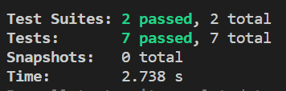
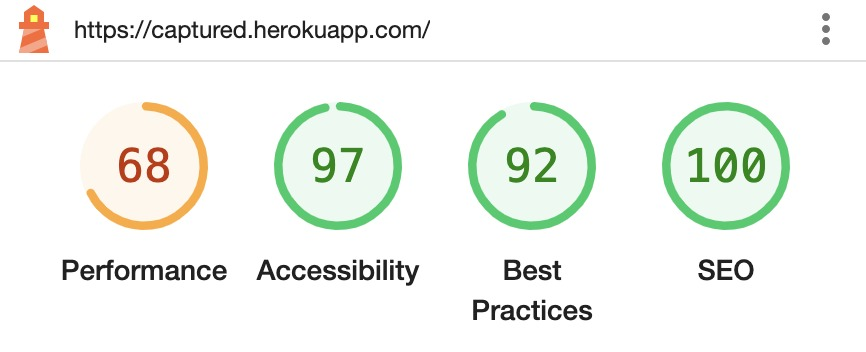

# Testing

Return to [README.md](README.md)

## Code Validation
All code written by me for this project has been validated. The final validation results can be seen below.

### W3C CSS Validation
All custom CSS code has been run through the [W3C CSS Validator](https://jigsaw.w3.org/css-validator/) as individual files (direct input) and through the deployed URL.

* No errors were presented.

### ESLint Validation
All JavaScript files were validated using the [ESLint](https://eslint.org/) JavaScript validator.

Some issues were raised and ammended. Most of them were in relation to indentation and line spacing.

A few other more specific errors that were amended are:
* Visible, non-interactive elements with click handlers must have at least one keyboard listener.
* Avoid non-native interactive elements.
    * The above two errors were resolved by adding a role attribute to the elements in question.
* Function component is not a function declaration.
    * This was resolved by changing the components in question to function declarations.

Some issues were intentionally ignored as they are in relation to code similar to or derived from the Moments WalkThrough project and posed no significant threat to the integrity or quality of the code. I am confident that the functionality of the site is not affected by any of these.

NB - I have used the Airbnb configuration for ESLint because I found it was the most precise and wide spread option. I found that when I did not use this configuration, most of these errors did not show.

The intentionally ignored errors are as follows:
* Props spreading is forbidden
* Identifier "foo_bar" is not in camel case
    * This is in relation to database fields in API.
* "foo" is already declared in the upper scope
* Do not use Array index in keys
* Fragments should contain more than one child
* Do not nest ternary expressions
* Expected an assignment or function call and instead saw an expression
* Do not pass children as props
* "foo" must be placed on a new line
    * Some instances when the linter asked for placement of content on new lines were ignored because in doing so, the readability of the code would be compromised.

## Responsiveness Testing
Tests were carried out throughout the development of the site using [Google Chrome Devtools](https://developer.chrome.com/docs/devtools/) to test responsiveness on different devices and screen sizes.

The testing produced acceptable results across multiple devices and adjustments have been made where needed to cater for changes in screen size. The site has been developed for use on small to large screen sizes (from mobile phones to laptops). I think there are some minor improvements that could be made in the future when it comes to responsive design but I am happy with the results at the present moment.

The main device screen sizes used for testing during development were:
* iphone 4
* Moto G4
* iPhone XR
* Samsung A53
* Asus vivobook (14inch)
* Nest Hub max
* iPad Pro

## Browser Compatibility
The site was tested on different browsers and the appearance, functionality and, responsiveness were consistent throughout. Please note that when viewing the site on Safari (and possibly other browsers and devices), the setting for "allow cross-website tracking" has to be turned off for the site to function correctly. This is a known issue and no action is needed for this version of the site as it is intended purely for educational purposes. More details on this can be found [here](#unresolved).

The browsers that I tested the site on are:
* Google Chrome
* Microsoft Edge
* Safari

## Manual User Story Testing
During development, each user story was thoroughly tested and developed using their respective acceptance criteria and tasks which can be found in the [project kanban board](https://github.com/users/Tony118g/projects/10).

To ensure the site functions as intended, I performed various extensive manual tests in relation to site goals and user stories. The resulting features related to this are evidenced in the features section of the [readme](README.md) although a summary can be seen below for each epic. All manual tests proved successful. 

* ### Authentication - all features and functionality described below are present and working.
    * New users are able to sign up by filling in a form that they can access via a link in the navbar.
    * Registered users are able to log in and log out via available links in the navbar.
        * The login link is available when the user is not authenticated and can be used to navigate to the login form which can be filled in and submitted in order to log in.
        * The logout nav option is available to logged-in users and logs a user out when clicked on.
    * The authentication status of a user is clearly shown.
        * When a user is logged out, a login nav option is available and features that are not relevant to them are not accessible.
        * When a user is logged in, the login nav option is replaced by a logout option. All features and content relevant to logged-in users are readily accessible and the user's account name and avatar are displayed in the navbar.
    * Functionality to refresh access tokens is working as expected and users can remain logged in for up to 24 hours.

* ### Navigation - all features and functionality described below are present and working.
    * The main and secondary navigation bars are readily available to all users. They are fully responsive and adaptive to user status and screen size.
    * The navigation bars remain fixed to the screen to ensure access when a user is scrolling.
        * The secondary navigation is fixed to the side of the screen on large screens and on the bottom of the screen on small screens.
        * Contents and styles change according to user status and screen size.
    * The secondary navbar is not available on form pages for large screens, this was done as it is not absolutely necessary on these pages and takes up needed space as well as the fact that the main navbar is still present and button options are available on the forms to return to previous pages. On small screens, the secondary nav is also shown since it does not take up much space.
    * Infinite scroll functionality works as expected and users are able to scroll through various page content such as tours, photos, and comments without having to refresh the page.
        * Content is automatically loaded as the user scrolls.

* ### Profile Management - all features and functionality described below are present and working.
    * Users are able to edit their profile details via related forms which are accessible through buttons in a dropdown menu on their profile page.
        * Users are able to choose options to edit their profile details (bio and avatar), username, or password.
    * Once users have filled in a related form to edit their profile data and submit it, the functionality to update relevant data works as expected.

* ### Profile Interaction - all features and functionality described below are present and working.
    * Users are able to view profile pages via profile links.
        * Each posted photo displays a link to the relevant owner's profile.
        * Logged-in users have access to a link for their own profile in the navbar.
        * Comments contain links to their relevant owner's profile.
        * Links to the top ten (top 4 on mobiles) most followed profiles can be accessed in the popular profiles section.
        * Links to users that have marked attendance on tours can be accessed in the tour attendance modal.
    * Profile pages display the following various data pertaining to a user:
        * The user's avatar and username.
        * The number of photos the user has posted
        * The number of followers/following the user has.
        * All photos that a user has posted.
    * All posted photos pertaining to a specific profile can be viewed on the relevant profile page underneath the display for their profile data and statistics.
    * On the majority of pages excluding form pages, a section displaying popular profiles is present.
        * On large screens this is displayed to the side and shows the top ten most followed users. This display is fixed so it is always available when scrolling. The height adjusts to screen size and any overflowing content is scrollable.
        * On small screens, the top 4 most followed profiles are displayed at the top of the page, however, it is not fixed as it is not important enough for it to be constantly taking up limited space.
    * Following functionality is in place and working as expected.
        * Users can follow/unfollow other users via buttons that are available on profile pages. On very large screens, these buttons are also available in the popular profiles display next to each link.

* ### Photo Post Management - all features and functionality described below are present and working.
    * Logged-in Users are able to post photos to the site via a photo creation form which can be accessed through an available link in the secondary navbar.
        * Once the user has filled in the form with valid data and submitted it, the photo is posted to the site and is displayed for users to view.
    * Logged-in users are able to edit their own photo posts via a form that is accessible through the dropdown menu available on the photo page.
        * When the user visits a page for their own photo, a dropdown menu is present with the option for editing the photo.
        * When the user navigates to the edit form, the form is prepopulated with current data.
        * When the user submits valid data, functionality works as expected to update the relevant photo.
    * Logged-in users are able to delete their own photo posts via the same dropdown menu mentioned above for editing.
        * When the user chooses the option to delete their photo and confirms the deletion, the photo is deleted and removed from the site.

* ### Photo Post Interaction - all features and functionality described below are present and working.
    * All posted photos are displayed on the home page of the site for all users to view.
        * The infinite scroll functionality works as intended to ensure all relevant content can be viewed on the same page.
    * Logged-in users can view photos posted by profiles that they follow via a link (feed) in the secondary navbar.
        * The feed page only displays photos posted by users that a user follows.
    * Functionality for logged-in users to like/unlike posted photos is in place and works as intended.
        * Like/unlike buttons are present on all posted photos.
        * If a user has liked a photo, when the like button is clicked again, the photo is unliked.
        * Functionality for this is restricted to logged-in users.
    * A search bar is present on pages pertaining to posted photos.
         * When users enter a search query, functionality works as expected to produce the relevant results.
        * Search functionality works for the photo title and owner fields.
    * Logged-in users are able to comment on photos via a comment form on the specific photo page.
        * When the user submits a valid comment, functionality works as expected to create the comment and add it to the comment list for the photo.
        * Functionality for this is restricted to logged-in users.
    * Logged-in users are able to edit their own comments via a form that is accessible through the dropdown menu available on each comment that they own.
        * When the user navigates to the edit form, the form is prepopulated with current data.
        * When the user submits valid data, functionality works as expected to update the relevant comment.
    * Logged-in users are able to delete their own comments via the same dropdown menu mentioned above for editing.
        * When the user chooses the option to delete their comment and confirms the deletion, the comment is deleted and removed from the site.
    * Users can view all comments for a specific photo on the photo's relevant page.
        * Comments pertaining to the photo are listed below it.
        * Each comment displays the owner in the form of a link to their profile, the time since the comment was created, and the comment content.

* ### Tour Post Management - all features and functionality described below are present and working.
    * Admin users are able to post tours to the site via a tour creation form which can be accessed through an available link in the secondary navbar.
        * Once the user has filled in the form with valid data and submitted it, the tour is posted to the site and is displayed for users to view.
        * This functionality is limited to admin users.
    * Admin users are able to edit any tour posts on the site via a form that is accessible through the dropdown menu available on each tour if the user is an admin. NB - If the dates for a tour have passed, the user is not allowed to edit it, they are however able to delete it.
        * When the user navigates to the edit form, the form is prepopulated with current data.
        * When the user submits valid data, functionality works as expected to update the relevant tour.
        * If the tour has passed and editing is not allowed, the user is presented with a message informing them of this when they hover over the edit button.
    * Admin users are able to delete any tours on the site via the same dropdown menu mentioned above for editing.
        * When the user chooses the option to delete a tour and confirms the deletion, the tour is deleted and removed from the site.

* ### Tour Post Interaction - all features and functionality described below are present and working.
    * All posted tours are displayed on the tours page of the site for all users to view.
        * This page can be accessed via a link in the secondary navbar.
        * The infinite scroll functionality works as intended to ensure all relevant content can be viewed on the same page.
    * A search bar is present on the tours page.
        * When users enter a search query, functionality works as expected to produce the relevant results.
        * Search functionality works for the tour title, country, and city fields.
    * Functionality for logged-in users to mark attendance on tours is in place and works as intended.
        * Mark/unmark as attending buttons are present on all posted tours.
        * The word tense of the buttons changes according to whether the tour has passed or not (attending or attended).
        * When a user marks attendance on a tour, their profile link is added to the list of attending users in the attendance list modal.
        * If a user has marked attendance on a tour, the button changes to display the word "unmark" instead of "mark" and if the user clicks the button again, the attendance mark is removed.
        * Functionality for this is restricted to logged-in users. 
    * On each tour there is also a button that displays the number of users who have marked attendance.
        * If a user clicks on this button, a modal is presented displaying a list of all users that have marked attendance on the relevant tour.
        * The names in the list are also links to each respective profile.

* ### General Site Interaction - all features and functionality described below are present and working.
    * Access to site features is based on authentication and user roles.
    * Certain content and features are restricted to users depending on their authentication status and other features are restricted to users depending on their role (admin or normal user).
    * Logged-out users:
        * Cannot:
            * Cannot create, edit, or delete any content on the site.
            * Cannot follow/unfollow users.
            * Cannot like/unlike photos.
            * Comment on photos.
            * Cannot mark tour attendance.
            * Do not have access to the full navigation menu or any pages that they are restricted to.
        * Can:
            * View all posted photos.
            * View comments on a photo.
            * View all posted tours.
            * View profile pages and the popular profiles display.
            * View a basic navigation selection.
    * Logged-in normal users:
        * Cannot:
            * Create, edit, or delete tours.
            * View the navigation option to create a tour.
            * Create, edit, or delete any content that does not belong to them.
            * Like their own photo.
            * Delete their profile.
        * Can:
            * Create photo posts and comments.
            * Edit, view, and delete any content that belongs to them such as photo posts and comments.
            * Edit their own profile data.
            * Like and unlike other users' photos.
            * Follow and unfollow other users.
            * Mark and unmark attendance on tours.
    * Logged-in admin users :
        * Cannot:
            * Edit or delete any content that does not belong to them besides tours.
            * Like their own photo.
            * Delete their profile.
        * Can:
            * Create photo posts and comments.
            * Edit, view, and delete any content that belongs to them such as photo posts and comments.
            * Edit their own profile data.
            * Create, edit, view, and delete any and all tours on the site.
    
    * Feedback messages are displayed in the form of alerts, popups, and tooltips.
        * Feedback alerts appear when:
            * A user creates, edits, or deletes a photo post.
            * A user deletes a comment.
            * A user edits their profile data.
            * An admin user creates, edits, or deletes a tour.
        * Feedback popups appear when:
            * An admin user hovers over the edit button for a past tour (to inform them that it cannot be edited and what the alternative measures are).
        * Feedback tooltips appear when:
            * A user hovers over the like button for their own photo post.
            * A logged-out user hovers over the like button (to inform them that they need to log in to like a photo).
            * A logged-out user hovers over the button to mark tour attendance (to inform them that they need to log in to mark attendance).

## Automated Testing

During development, I created automated tests for the NavBar.js and SecondaryNav.js components. The folder containing these tests can be found in the components folder. I found this very beneficial in helping ensure that the site's navigation functionailty works as intended. In future, I would definitely encorporate more automated tests throughout the site as I have seen how useful they can be.

## Known Bugs

### Resolved

* When creating tours, users were unable to create one without inputing an image.
    * This was resolved by only appending image data in the form if one has been input so that by not appending any data, the default value in the API would be used.
    * NB -  For photo creation, an image input is intentionally required.
* Non admin users could access the tour creation page.
    * This was resolved by creating a custom hook to redirect non admin users when trying to access the tour creation page.
* All users could access tour and photo edit pages using a non existant id.
    * Although this would not allow any editing of actual objects, I wanted to resolve it since it is a bad user experience.
    * This was resolved by checking the error returned and if the error is "404 not found" (since no object exists for a non existant id) then redirect the user to the home page.
* Various code validation errors were resolved and details about this can be seen in the [ESLint Validation](#eslint-validation) section.

### Unresolved

Due to the project front end and back end being hosted somewhat separately Some browsers and devices will not render full site functionality unless the setting for "cross-website-tracking" has been turned off. As this site was developed strictly for educational purposes, no action needs to be taken to resolve this.

Other than this, due to extensive testing, I am confident that there are no other unresolved bugs to the best of my knowledge.

## Additional testing

### Lighthouse
I used the [Google lighthouse](https://developer.chrome.com/docs/lighthouse/overview/) test in Chrome Developer Tools to test pages on the site. This was used to test the following:

* Performance
* Accessibility
* Best Practices
* SEO

The results were acceptable for my expectations of this project. As I was mainly focused on the functionality aspect of the site, I allowed less time for ensuring high-quality performance, however, I am still pleased with the resulting outcome.

Below is an example of the lighthouse results for the home page. Other page's results differed slightly but the differences were not significant.

### Peer Review
In addition to the above testing procedures, the site was reviewed by my mentor and my wife. This helped me get other people's opinions and receive real-world feedback. All feedback was positive and led me to believe that all expected standards of quality and functionality have been met.

Return to [README.md](README.md)